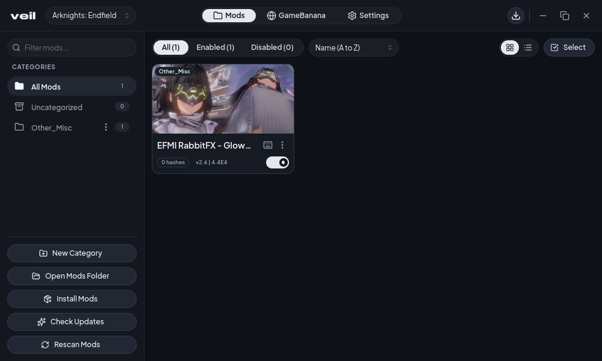
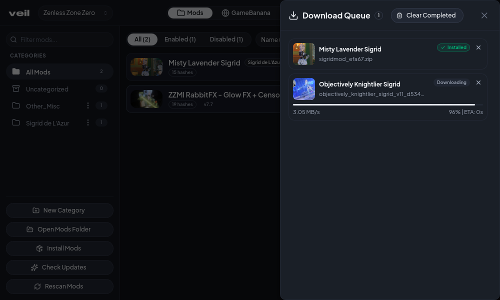
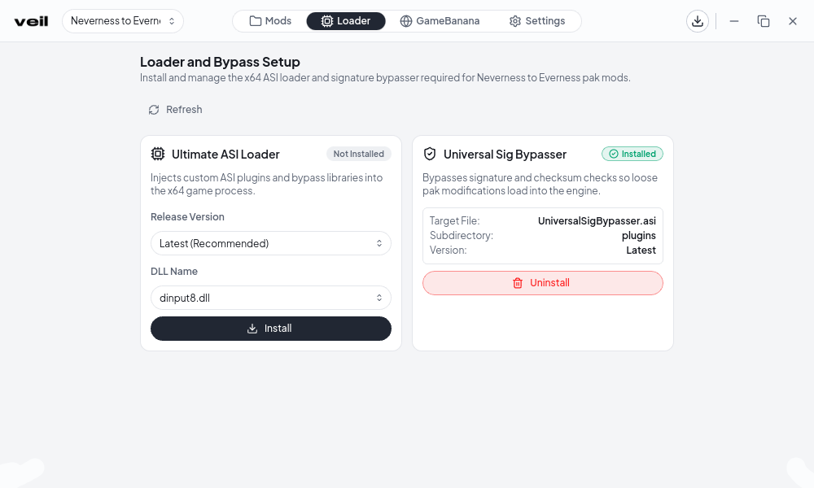

# Veil

Yet another 3DMigoto (and NTE) mod manager

<p align="center">
  
  
</p>

<p align="center">
  
  
</p>

## Features

- Supports Windows and Linux
- Works with all 3DMigoto-based games (AKEF, GI, HI3, HSR, WuWa, ZZZ) + NTE (NEMI and pak)
- Built-in NTE pak loader management (Ultimate ASI Loader + Universal Sig Bypasser)
- Non-destructive mod activation using symlinks and _P suffix
- Mod organization with images, categories, filters, batch operations, and automatic subfolder handling
- Per-game mod presets for quick switching between specific mods
- Integrated GameBanana browser for downloading mods with automatic update tracking and handling
- Built-in download manager with queue and direct archive extraction (.7z, .zip, .rar)
- Interactive INI keybind/variable editor with support (via d3dx_user.ini)
- Mod conflict detector using hashes

## Installation

You can download prebuilt application bundles from [Releases](https://github.com/vzpyr/veil/releases).

## Building

You need Node.js and Rust.

```bash
npm install
npm run tauri build
```

Binaries will afterwards land in `src-tauri/target/release/`.

## License

[MIT](LICENSE)
